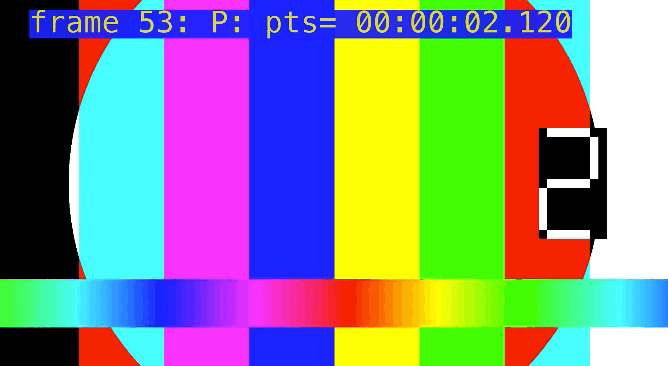

# Awesome Video 

Collection of links, resources and manuals for anybody in the video production

||
| -------------        |
| [Test files created with ffmpeg](ffmpeg.md) |

## Test files

- **Resolutions/Bitrates/Codecs/FPS tests (TBD)**
  colorbars files with the frame numbers and time in milliseconds
  - [**1920x1080/50FPS**](raw/master/test_files/50.mp4) 60 seconds full hd mp4 color bars with a timecode and a number of frames
    *60s, 1920 pixels x 1080 pixels, 50FPS, YUV : 4:2:0, Progressive, 10 MByte*
  - [**1920x1080/25FPS**](raw/master/test_files/25.mp4) 60 seconds full hd mp4 color bars with a timecode and a number of frames
    *60s, 1920 pixels x 1080 pixels, 25FPS, YUV : 4:2:0, Progressive, 7 MByte*
- **Filename test** Special characters and long file names
  *each file: 10s, 1920 pixels x 1080 pixels, size is less than 400 KByte*
    - [__  ä ö ü ß â é è Ä Ö Ü ß -.mp4](https://github.com/vidanov/video/raw/master/test_files/characters/%3D%20%3F%20%60%20´%20%2B%20*%20±%20%20%23%20'%20%3B%20%2C%20%20-%20_%20:%20«%20æ%20%40%20.mp4)
    - [« file ä ö ü ß â é è  ».mp4](https://github.com/vidanov/video/raw/master/test_files/characters/«%20file%20ä%20ö%20ü%20ß%20â%20é%20è%20%20».mp4)
    - [^ ° ! " § $ % & / ( ).mp4](https://github.com/vidanov/video/raw/master/test_files/characters/%5E%20°%20!%20%22%20§%20%24%20%25%20%26%20:%20(%20).mp4)
    - [= ? ` ´ + * ±  # ' ; ,  - _ / « æ @ .mp4](https://github.com/vidanov/video/raw/master/test_files/characters/%3D%20%3F%20%60%20´%20%2B%20*%20±%20%20%23%20'%20%3B%20%2C%20%20-%20_%20:%20«%20æ%20%40%20.mp4)
    - [long7893123456789412345678951234567896123456789712345678981234567899178931234567894123456789512345678961234567897123456789812345678991234567890s.mp4](https://github.com/vidanov/video/raw/master/test_files/characters/long7893123456789412345678951234567896123456789712345678981234567899178931234567894123456789512345678961234567897123456789812345678991234567890s.mp4)
- **Filesize test**
  - 100MB
  - 1Gb
  - 2GB
  - 4GB
  - 6GB
- **Stitching test. Number of files** 
  - 2
  - 10
  - 20
  - 30
  - 40
  - 50
- **Corrupted file test**
  - [corrupted.mp4](https://github.com/vidanov/video/raw/master/test_files/corrupted.mp4) 10MB non video file

## Video Links

- [My collection](Video_Links.md)
- [FFMPEG shortcuts](ffmpeg.md)

