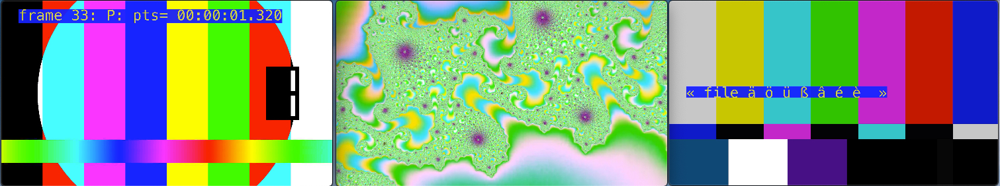

## FFMPEG shortcuts



## Create a test file 


Color bars 1
```bash
$ ffmpeg -f lavfi -i testsrc=duration=60:size=1920x1080:rate=50 testsrc.mpg
```


Color bars 2

```bash
$ ffmpeg -f lavfi -i smptebars=duration=10:size=1280x720:rate=25 smptebars.mp4
```


Interlaced mandelbrot

```bash
ffmpeg -hide_banner -t 10 -y -f lavfi -i anullsrc=r=48k:cl=stereo -f lavfi -i mandelbrot=r=50:size=1920x1080 -vf 'interlace=scan=tff:lowpass=complex,format=yuv420p' -flags +ildct -codec:a aac -b:a 128k -aac_coder twoloop -codec:v libx264 -preset veryfast -tune animation -profile:v high -crf 35 -level 5.2 -shortest mandelbrot.mp4
```

source: https://superuser.com/questions/1344442/ffmpeg-how-to-create-an-interlaced-h-264-video


## Add text


```bash
$ ffmpeg -i video.mp4 -vf "drawtext=fontfile=/System/Library/Fonts/Menlo.ttc:text='Hello': x=100: y=500: fontsize=84: fontcolor=yellow@0.8: box=1: boxcolor=blue@0.9" -c:a copy -c:v libx264 -preset veryfast -crf 16 -x264-params keyint=60 -map 0  output.mp4
```

## Add timecodes

```bash
$ ffmpeg -i   testsrc.mpg -filter_complex "drawtext=fontfile=/System/Library/Fonts/Menlo.ttc:text='frame %{n}\\: %{pict_type}\\: pts=%{pts \\: hms}': x=100: y=50: fontsize=84: fontcolor=yellow@0.8: box=1: boxcolor=blue@0.9" -c:a copy -c:v libx264 -preset veryfast -crf 16 -x264-params keyint=60 -map 0  testsrcb.mp4
```

## Empty video

```bash
$ ffmpeg -t 60 -s 1920x1080 -f rawvideo -pix_fmt rgb24 -r 25 -i /dev/zero empty.mpeg

```

UPDATE:

-t:       length of the video (in H: m:s format 00:00:00 or in seconds 0.000)
-s:       frame size
-f:       video format
-pix_fmt: pixel format
-r:       fps
-i:       input


## Links

- https://serverless.com/blog/serverless-application-for-long-running-process-fargate-lambda/

- https://devopstar.com/2019/01/28/serverless-watermark-using-aws-lambda-layers-ffmpeg/